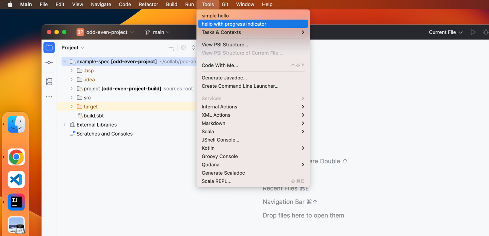

## This repository contains a sample `ij-plugin` and `example-spec`

#### running `ij-plugin` should open a new instance of intellij plugin
#### open `example-spec` in new instance, and trigger action from `Tools` menu <br/><br/>



<ins>Note :-</ins>

build `ij-plugin` using `sbt clean compile packageArtifact` and run it.

`MinimalExample` plugin has a dependency on `Scala` plugin (so a reestart of `MinimalExample` plugin required after installing `Scala` plugin)

---

`SimpleHelloAction` works fine without error (**first option in tools menu**), but   
`withProgressSynchronously` call in `HelloWithProgressIndicationAction` gives below error :-


<details><summary>exception trace triggered by action</summary>

```
2025-05-09 20:13:28,097 [ 625626] SEVERE - #c.i.i.p.PluginManager - loader constraint violation: when resolving method 'java.lang.Object org.jetbrains.plugins.scala.extensions.package$.withProgressSynchronously(java.lang.String, boolean, scala.Function0)' the class loader com.intellij.ide.plugins.cl.PluginClassLoader @121a22da of the current class, com/example/actions/HelloWithProgressIndicationAction, and the class loader com.intellij.ide.plugins.cl.PluginClassLoader @72d555f for the method's defining class, org/jetbrains/plugins/scala/extensions/package$, have different Class objects for the type scala/Function0 used in the signature (com.example.actions.HelloWithProgressIndicationAction is in unnamed module of loader com.intellij.ide.plugins.cl.PluginClassLoader @121a22da, parent loader 'bootstrap'; org.jetbrains.plugins.scala.extensions.package$ is in unnamed module of loader com.intellij.ide.plugins.cl.PluginClassLoader @72d555f, parent loader 'bootstrap')
java.lang.LinkageError: loader constraint violation: when resolving method 'java.lang.Object org.jetbrains.plugins.scala.extensions.package$.withProgressSynchronously(java.lang.String, boolean, scala.Function0)' the class loader com.intellij.ide.plugins.cl.PluginClassLoader @121a22da of the current class, com/example/actions/HelloWithProgressIndicationAction, and the class loader com.intellij.ide.plugins.cl.PluginClassLoader @72d555f for the method's defining class, org/jetbrains/plugins/scala/extensions/package$, have different Class objects for the type scala/Function0 used in the signature (com.example.actions.HelloWithProgressIndicationAction is in unnamed module of loader com.intellij.ide.plugins.cl.PluginClassLoader @121a22da, parent loader 'bootstrap'; org.jetbrains.plugins.scala.extensions.package$ is in unnamed module of loader com.intellij.ide.plugins.cl.PluginClassLoader @72d555f, parent loader 'bootstrap')
	at com.example.actions.HelloWithProgressIndicationAction.actionPerformed(HelloWithProgressIndicationAction.scala:19)
	at com.intellij.openapi.actionSystem.ex.ActionUtil.doPerformActionOrShowPopup(ActionUtil.kt:383)
	at com.intellij.openapi.actionSystem.ex.ActionUtil.performActionDumbAwareWithCallbacks$lambda$7(ActionUtil.kt:353)
	at com.intellij.openapi.actionSystem.impl.ActionManagerImpl.performWithActionCallbacks(ActionManagerImpl.kt:1167)
	at com.intellij.openapi.actionSystem.ex.ActionUtil.performActionDumbAwareWithCallbacks(ActionUtil.kt:352)
	at com.intellij.platform.ide.menu.MacNativeActionMenuItemKt.performAction$lambda$1(MacNativeActionMenuItem.kt:133)
	at com.intellij.openapi.wm.impl.FocusManagerImpl.runOnOwnContext(FocusManagerImpl.java:231)
	at com.intellij.platform.ide.menu.MacNativeActionMenuItemKt.performAction(MacNativeActionMenuItem.kt:128)
	at com.intellij.platform.ide.menu.MacNativeActionMenuItemKt.access$performAction(MacNativeActionMenuItem.kt:1)
	at com.intellij.platform.ide.menu.MacNativeActionMenuItem.menuItemPeer$lambda$4$lambda$3$lambda$2$lambda$1$lambda$0(MacNativeActionMenuItem.kt:50)
	at com.intellij.openapi.application.WriteIntentReadAction.lambda$run$0(WriteIntentReadAction.java:24)
	at com.intellij.openapi.application.impl.AnyThreadWriteThreadingSupport.runWriteIntentReadAction$lambda$6(AnyThreadWriteThreadingSupport.kt:274)
	at com.intellij.openapi.application.impl.AnyThreadWriteThreadingSupport.runWithTemporaryThreadLocal(AnyThreadWriteThreadingSupport.kt:204)
	at com.intellij.openapi.application.impl.AnyThreadWriteThreadingSupport.runWriteIntentReadAction(AnyThreadWriteThreadingSupport.kt:274)
	at com.intellij.openapi.application.impl.AnyThreadWriteThreadingSupport.runWriteIntentReadAction(AnyThreadWriteThreadingSupport.kt:222)
	at com.intellij.openapi.application.impl.ApplicationImpl.runWriteIntentReadAction(ApplicationImpl.java:1009)
	at com.intellij.openapi.application.WriteIntentReadAction.compute(WriteIntentReadAction.java:55)
	at com.intellij.openapi.application.WriteIntentReadAction.run(WriteIntentReadAction.java:23)
	at com.intellij.platform.ide.menu.MacNativeActionMenuItem.menuItemPeer$lambda$4$lambda$3$lambda$2$lambda$1(MacNativeActionMenuItem.kt:49)
	at com.intellij.openapi.application.TransactionGuardImpl.performActivity(TransactionGuardImpl.java:117)
	at com.intellij.openapi.application.TransactionGuardImpl.performUserActivity(TransactionGuardImpl.java:98)
	at com.intellij.platform.ide.menu.MacNativeActionMenuItem.menuItemPeer$lambda$4$lambda$3$lambda$2(MacNativeActionMenuItem.kt:47)
	at com.intellij.util.concurrency.ChildContext$runInChildContext$1.invoke(propagation.kt:102)
	at com.intellij.util.concurrency.ChildContext$runInChildContext$1.invoke(propagation.kt:102)
	at com.intellij.util.concurrency.ChildContext.runInChildContext(propagation.kt:108)
	at com.intellij.util.concurrency.ChildContext.runInChildContext(propagation.kt:102)
	at com.intellij.util.concurrency.ContextRunnable.run$$$capture(ContextRunnable.java:27)
	at com.intellij.util.concurrency.ContextRunnable.run(ContextRunnable.java)
	at --- Async.Stack.Trace --- (captured by IntelliJ IDEA debugger)
	at com.intellij.util.concurrency.ContextRunnable.<init>(ContextRunnable.java:15)
	at com.intellij.util.concurrency.Propagation.capturePropagationContext(propagation.kt:372)
	at com.intellij.util.concurrency.Propagation.capturePropagationContext$default(propagation.kt:363)
	at com.intellij.util.concurrency.Propagation.captureRunnableThreadContext(propagation.kt:275)
	at com.intellij.concurrency.ThreadContext.captureThreadContext(threadContext.kt:391)
	at com.intellij.ide.IdeEventQueue.attachClientIdIfNeeded(IdeEventQueue.kt:753)
	at com.intellij.ide.IdeEventQueue.doPostEvent(IdeEventQueue.kt:729)
	at com.intellij.ide.IdeEventQueue.postEvent(IdeEventQueue.kt:717)
	at java.desktop/java.awt.EventQueue.invokeLater(EventQueue.java:1326)
	at com.intellij.platform.ide.menu.MacNativeActionMenuItem.menuItemPeer$lambda$4$lambda$3(MacNativeActionMenuItem.kt:45)
	at com.intellij.ui.mac.screenmenu.MenuItem.handleAction(MenuItem.java:142)
2025-05-09 20:13:28,122 [ 625651] SEVERE - #c.i.i.p.PluginManager - IntelliJ IDEA 2025.1 RC  Build #IC-251.23774.318
2025-05-09 20:13:28,123 [ 625652] SEVERE - #c.i.i.p.PluginManager - JDK: 21.0.6; VM: OpenJDK 64-Bit Server VM; Vendor: JetBrains s.r.o.
2025-05-09 20:13:28,123 [ 625652] SEVERE - #c.i.i.p.PluginManager - OS: Mac OS X
2025-05-09 20:13:28,123 [ 625652] SEVERE - #c.i.i.p.PluginManager - Plugin to blame: MinimalExample version: 2023.2.27.1
2025-05-09 20:13:28,124 [ 625653] SEVERE - #c.i.i.p.PluginManager - Last Action: com.example.actions.HelloWithProgressIndicationActionId
```

</details>

---

<details><summary>sbt clean compile packageArtifact logs from command line</summary>

```
❯ sbt clean compile packageArtifact

[info] welcome to sbt 1.7.1 (Amazon.com Inc. Java 17.0.11)
[info] loading settings for project ij-plugin-build from plugins.sbt ...
[info] loading project definition from /Users/ecko/collab/poc-and-reproducibles/ij-plugin-classloader-issue/ij-plugin/project
[info] loading settings for project scalaIntellij from build.sbt ...
[info] set current project to ij-minimal-plugin (in build file:/Users/ecko/collab/poc-and-reproducibles/ij-plugin-classloader-issue/ij-plugin/)
[info] + IdeaDependency(BuildInfo(ideaIC-251.23774.318)) is up to date: 2/2
[warn] Failed to check locally installed JBR version(assuming true): /Users/ecko/.scala-minimalPluginIC/sdk/251.23774.318/jbr/release
[info] + JbrDependency(AutoJbr(None,None,None)) is up to date: 1/1
[info] + PluginDependency(org.intellij.scala) is up to date: 17/17
[success] Total time: 0 s, completed 9 May 2025, 21:27:10
[info] Executing in batch mode. For better performance use sbt's shell
[success] Total time: 5 s, completed 9 May 2025, 21:27:16
[info] compiling 1 Scala source to /Users/ecko/collab/poc-and-reproducibles/ij-plugin-classloader-issue/ij-plugin/target/scala-2.13/classes ...
[success] Total time: 10 s, completed 9 May 2025, 21:27:26
[info] building node stubs from root: ProjectRef(file:/Users/ecko/collab/poc-and-reproducibles/ij-plugin-classloader-issue/ij-plugin/,scalaIntellij)
[info] building node graph from nodes: List({ij-minimal-plugin})
[info] building mappings for 1 nodes
[info] started dumping structure
[info] Cache file is empty or doesn't exist
[info] (56ms) copyJar: /Users/ecko/collab/poc-and-reproducibles/ij-plugin-classloader-issue/ij-plugin/target/plugin/scala-minimal/lib/scala-library-2.13.16.jar
[info] (4ms) copyJar: /Users/ecko/collab/poc-and-reproducibles/ij-plugin-classloader-issue/ij-plugin/target/plugin/scala-minimal/lib/better-files_2.13-3.9.2.jar
[info] (6ms) copyJar: /Users/ecko/collab/poc-and-reproducibles/ij-plugin-classloader-issue/ij-plugin/target/plugin/scala-minimal/lib/cats-core_2.13-2.10.0.jar
[info] Wrote 3 files to /Users/ecko/collab/poc-and-reproducibles/ij-plugin-classloader-issue/ij-plugin/target/plugin/scala-minimal/lib/ij-minimal-plugin.jar
[info] (41ms) packageJar(1): /Users/ecko/collab/poc-and-reproducibles/ij-plugin-classloader-issue/ij-plugin/target/plugin/scala-minimal/lib/ij-minimal-plugin.jar
[info] (4ms) copyJar: /Users/ecko/collab/poc-and-reproducibles/ij-plugin-classloader-issue/ij-plugin/target/plugin/scala-minimal/lib/cats-kernel_2.13-2.10.0.jar
[info] (1ms) copyJar: /Users/ecko/collab/poc-and-reproducibles/ij-plugin-classloader-issue/ij-plugin/target/plugin/scala-minimal/lib/cats-effect-std_2.13-3.4.4.jar
[info] (1ms) copyJar: /Users/ecko/collab/poc-and-reproducibles/ij-plugin-classloader-issue/ij-plugin/target/plugin/scala-minimal/lib/mouse_2.13-1.2.3.jar
[info] (1ms) copyJar: /Users/ecko/collab/poc-and-reproducibles/ij-plugin-classloader-issue/ij-plugin/target/plugin/scala-minimal/lib/cats-effect_2.13-3.4.4.jar
[info] (2ms) copyJar: /Users/ecko/collab/poc-and-reproducibles/ij-plugin-classloader-issue/ij-plugin/target/plugin/scala-minimal/lib/cats-effect-kernel_2.13-3.4.4.jar
[info] (161ms) <== Artifact total assembly ==>
[success] Total time: 1 s, completed 9 May 2025, 21:27:26
```

</details>